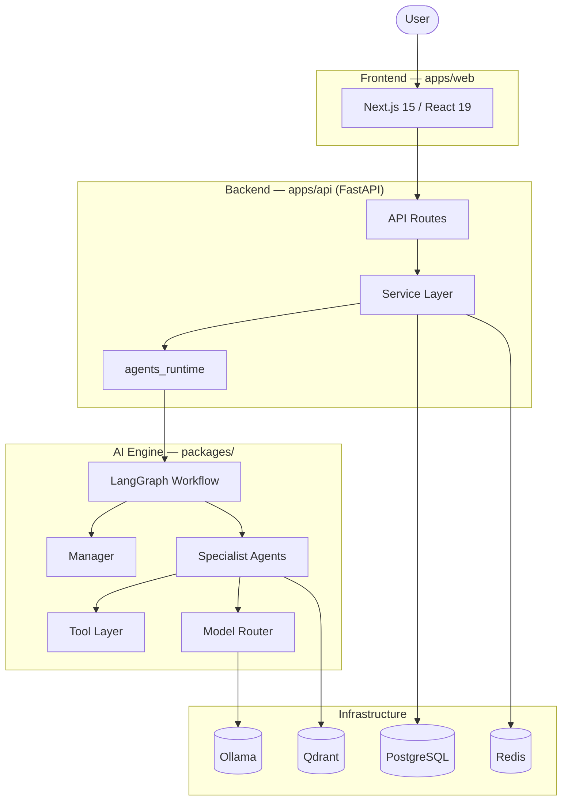

# Architecture

The whole system in one document. For the original product vision see
[`00-product-design/`](00-product-design/); for the "why" behind each choice see
[decisions.md](decisions.md).

## Vision

ForgeAI is an autonomous AI engineering platform that behaves like a **team of
software engineers**, not a single chatbot. A user states a task in plain
language; a Manager agent decomposes it and delegates to specialists who plan,
research, code, execute, test, review, and commit — observably, in a sandbox.

## Goals

- **Team over chatbot** — division of labor with checkpoints and self-correction.
- **Local-first** — runs fully offline on Ollama; no API keys required.
- **Provider-independent** — swap LLM providers without touching agent code.
- **Auditable & safe** — every action recorded; untrusted code runs sandboxed.
- **Production-grade** — clean architecture, documented, tested.

## Component overview



| Component        | Where             | Responsibility                                  |
|------------------|-------------------|-------------------------------------------------|
| Frontend         | `apps/web`        | UI: chat, dashboard, workspace, settings        |
| API layer        | `apps/api/app/api`| HTTP/WS endpoints, validation                   |
| Service layer    | `apps/api/app`    | business logic, runtime wiring (`agents_runtime`)|
| Workflow         | `packages/agents/workflow.py` | LangGraph orchestration             |
| Agents           | `packages/agents` | the specialist team                             |
| Tools            | `packages/tools`  | the agents' hands (filesystem, …)               |
| Model Router     | `packages/models` | role → model → provider                         |
| Core             | `packages/core`   | shared `ProjectState` + message contracts       |
| Prompts          | `packages/prompts`| per-agent system prompts                        |

## Monorepo layout

```
forge-ai/
├── apps/
│   ├── web/                 Next.js frontend
│   └── api/                 FastAPI backend
├── packages/
│   ├── agents/  core/  prompts/  tools/  models/  memory/  rag/
├── infrastructure/
│   ├── docker/  postgres/  redis/  qdrant/  ollama/
├── docs/                    how it works
├── specs/                   what each component must do
├── scripts/  .env.example  docker-compose.yml  Makefile  README.md
```

Why a monorepo: 10+ agents, 30+ APIs, 100+ prompts, multiple LLMs — a flat
split won't scale. → [ADR-0006](adr/ADR-0006.md)

## Data flow

```
Frontend → API Routes → Service Layer → agents_runtime → LangGraph Workflow
        → Manager (delegates) → Specialist Agents → Tools / Model Router → LLM
        → shared ProjectState → final_response → API → Frontend
```

Every request flows through the workflow over one shared `ProjectState`
([state.md](state.md)); no agent calls another directly ([workflows.md](workflows.md)).

## Local services (Docker Compose)

```
PostgreSQL  system of record   |  Redis   jobs / queue / locks
Qdrant      vector embeddings  |  Ollama  local LLMs
ForgeAI API FastAPI app        |  (later: Langfuse, nginx)
```

## Model routing

Agents never call a provider SDK directly — they go through the Model Router
(`packages/models`). For the MVP everything is local via **Ollama**:

| Env var          | Default            | Role                     |
|------------------|--------------------|--------------------------|
| `MODEL_PLANNER`  | `qwen3:8b`         | Planning & reasoning     |
| `MODEL_CODER`    | `deepseek-coder`   | Code generation          |
| `MODEL_RESEARCH` | `llama3.1:8b`      | Research & summaries     |
| `MODEL_EMBED`    | `nomic-embed-text` | Embeddings for RAG       |

No OpenAI key. No Claude key. → [ADR-0003](adr/ADR-0003.md)

## Future

Sandboxed execution (Docker), Memory + RAG (Qdrant), GitHub integration, auth,
the full dashboard, and production deploy — see [roadmap.md](roadmap.md).
Provider expansion (OpenAI/Claude/Gemini) is a drop-in via the Model Router.
