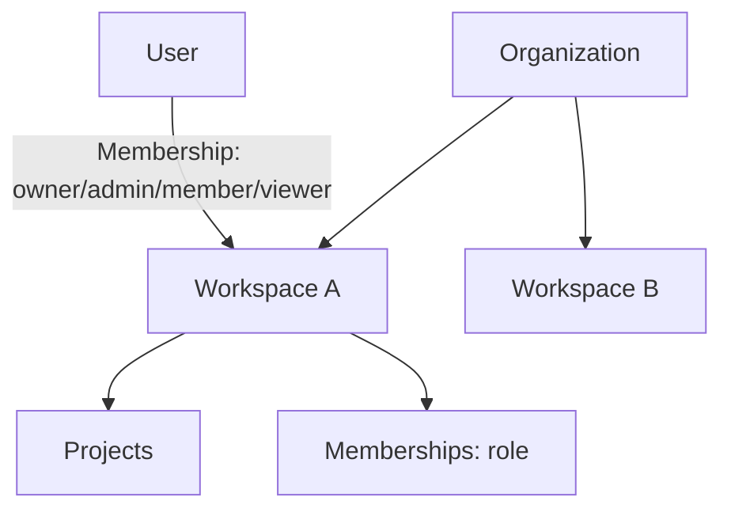

# Authentication, Multi-User Workspaces & Team Collaboration

Phase 7 takes ForgeAI from single-user to a multi-tenant, team platform —
think GitHub / Linear / Notion org structure.

**Source:** `apps/api/app/auth/`, `apps/api/app/db/`, `apps/api/app/api/{auth,organizations}.py`,
`apps/web/src/app/login`.

## Tenancy model



```
Organization → Workspace → Project → (Task → Run, Memory)
User —(Membership: role)→ Workspace
```

## Authentication

JWT, fully local — no paid auth provider.

- **Passwords:** hashed with **Argon2** (`argon2-cffi`); never stored in plaintext.
- **Tokens:** short-lived **access** (15 min) + long-lived **refresh** (30 days),
  signed with `JWT_SECRET`.
- **Flow:** register → login → `{access, refresh}` → `Authorization: Bearer`
  on protected routes → `/auth/refresh` to rotate → `/auth/logout` to revoke.
- **Revocation:** logout adds the token to a denylist (in-memory now; Redis with
  TTL in production) so it's invalid immediately.

| Endpoint | Purpose |
|----------|---------|
| `POST /auth/register` | create a user |
| `POST /auth/login` | issue access + refresh tokens |
| `POST /auth/refresh` | rotate tokens |
| `POST /auth/logout` | revoke access + refresh |
| `GET /auth/me` | current user (protected) |

## RBAC

Roles live on `Membership` (a user's role *within a workspace*), ranked
`owner > admin > member > viewer`:

| Role | Can |
|------|-----|
| **Owner** | manage team, delete project, manage billing/models |
| **Admin** | invite members, manage projects/agents |
| **Member** | create tasks, use agents, read projects |
| **Viewer** | read only |

Guards (`app/auth/deps.py`):
- **Auth required** — `current_user` resolves the bearer token (rejects revoked).
- **Role / workspace isolation** — `require_workspace_role(ws, min_role, …)`
  returns 403 if the user isn't a member or lacks the rank. A user **cannot**
  touch a workspace they don't belong to.

## Multi-tenancy endpoints

| Endpoint | Role required | Purpose |
|----------|---------------|---------|
| `POST /orgs` | authed | create org + default workspace (creator → OWNER) |
| `POST /orgs/{id}/workspaces` | org owner | add a workspace |
| `POST /orgs/workspaces/{ws}/invite` | ADMIN+ | create an invite code |
| `POST /orgs/invite/accept` | authed | join via invite code |
| `GET /orgs/workspaces/{ws}/members` | VIEWER+ | list members |
| `GET /orgs/workspaces/{ws}/activity` | VIEWER+ | activity feed |

Invitations use an **invite code** (no email for the MVP) with a 7-day expiry.

## Collaboration & governance

- **Activity feed** — every significant action writes an `Activity` row
  (`org.created`, `member.invited`, `member.joined`, …) → GitHub-style feed.
- **Comments** — `Comment` model for project/task discussion threads.
- **Approvals** — `Approval` model + the Phase 6 `HumanApprovalCenter` gate
  destructive actions (delete/push/deploy).
- **Audit** — `Activity` doubles as the audit trail (who → what → when → where).
- **Shared memory & runs** — memory and run history are scoped to the
  workspace/project (Phase 4/6), so the whole team benefits.

## Frontend

- `/login` — sign-in / register, stores the token pair (`useAuthStore`,
  persisted to localStorage).
- Token pair powers authenticated calls; the workspace switcher and team
  dashboard build on the org/workspace endpoints.

## Data model

See [database.md](database.md) for the full schema (users, organizations,
workspaces, memberships, projects, invitations, approvals, activity, comments).

## Offline-first (ADR-0018)

The data layer runs on **SQLite in-memory** for tests and **PostgreSQL** in
production — same async SQLAlchemy models, selected by `DATABASE_URL`. The whole
auth + multi-tenancy suite runs with no database server.

## Spec

Binding contract: [`../specs/auth-spec.md`](../specs/auth-spec.md).
