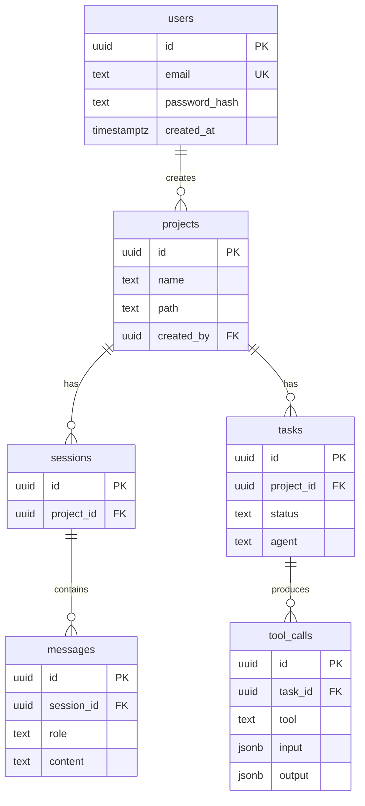

# Database Design

Initial PostgreSQL schema for the MVP. **Planned here; implemented with
SQLAlchemy + Alembic in the Database phase** ([roadmap.md](roadmap.md)). This is
enough for v1.0.

## ER diagram

## Entities

### users
| Column         | Type        | Notes                  |
|----------------|-------------|------------------------|
| id             | uuid (PK)   |                        |
| email          | text        | unique                 |
| password_hash  | text        |                        |
| created_at     | timestamptz | default now()          |

### projects
| Column       | Type        | Notes                       |
|--------------|-------------|-----------------------------|
| id           | uuid (PK)   |                             |
| name         | text        |                             |
| description  | text        | nullable                    |
| path         | text        | workspace path on disk      |
| created_by   | uuid (FK)   | → users.id                  |
| created_at   | timestamptz | default now()               |

### sessions
A conversation thread within a project.
| Column      | Type        | Notes              |
|-------------|-------------|--------------------|
| id          | uuid (PK)   |                    |
| project_id  | uuid (FK)   | → projects.id      |
| created_at  | timestamptz | default now()      |

### messages
| Column      | Type        | Notes                          |
|-------------|-------------|--------------------------------|
| id          | uuid (PK)   |                                |
| session_id  | uuid (FK)   | → sessions.id                  |
| role        | text        | user / assistant / agent       |
| content     | text        |                                |
| created_at  | timestamptz | default now()                  |

### tasks
A unit of work executed by the agent team.
| Column      | Type        | Notes                                   |
|-------------|-------------|-----------------------------------------|
| id          | uuid (PK)   |                                         |
| project_id  | uuid (FK)   | → projects.id                           |
| status      | text        | pending / running / done / failed       |
| agent       | text        | which agent currently owns the task     |
| created_at  | timestamptz | default now()                           |

### tool_calls
The audit record of every tool invocation an agent makes (the backing store for
the Logs UI). Mirrors the `AgentMessage`/tool trail in [state.md](state.md).
| Column     | Type        | Notes                          |
|------------|-------------|--------------------------------|
| id         | uuid (PK)   |                                |
| task_id    | uuid (FK)   | → tasks.id                     |
| tool       | text        | filesystem / terminal / git …  |
| input      | jsonb       | tool arguments                 |
| output     | jsonb       | `ToolResult` (ok/output/error) |
| created_at | timestamptz | default now()                  |

## Indexes & constraints

- **PKs:** UUID on every table (avoids enumeration, eases distribution).
- **Unique:** `users.email`.
- **Foreign keys:** `projects.created_by → users`, `sessions.project_id →
  projects`, `messages.session_id → sessions`, `tasks.project_id → projects`,
  `tool_calls.task_id → tasks` — all `ON DELETE CASCADE` so deleting a project
  cleans up its children.
- **Indexes (planned):** `projects(created_by)`, `sessions(project_id)`,
  `messages(session_id, created_at)`, `tasks(project_id, status)`,
  `tool_calls(task_id, created_at)` — to support the common list/timeline reads.
- **Extensions:** `pgcrypto` for `gen_random_uuid()` (see
  `infrastructure/postgres/init.sql`).

## Notes & future tables

- `status` / `role` / `agent` are text for now; may become enums once the agent
  roster is final.
- Embeddings/vectors live in **Qdrant**, not Postgres ([architecture.md](architecture.md)).
- **Future:** `logs` (structured run logs), `users.settings` (model
  preferences), `api_keys`, `project_memory` (long-term memory pointers).
