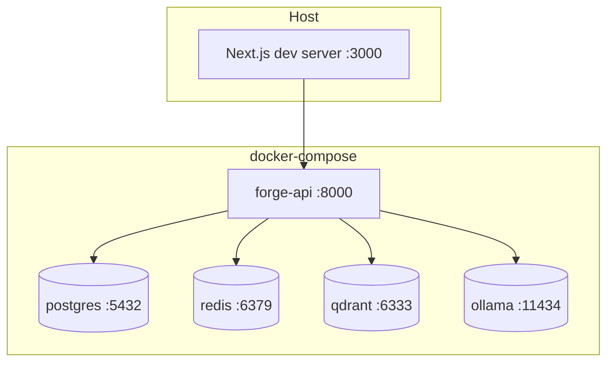

# Deployment

How ForgeAI runs, from a laptop today to a server later. The full production
deploy is its own roadmap phase; this documents the model and the path.

## Local (today)

One command brings up the whole stack via Docker Compose:

```bash
make up          # postgres, redis, qdrant, ollama, forge-api
make pull-models # one-time model download (~20 GB)
make web-dev     # Next.js frontend on the host
```

See [setup.md](setup.md) for details. Topology:



## Configuration

All config is environment-driven (`.env`, from `.env.example`). Nothing is
hardcoded — models, datastore URLs, JWT secret, ports. In Compose, the API gets
in-network hostnames (`postgres`, `redis`, …); on the host they're `localhost`.

## Production (planned)

| Concern        | Plan                                                       |
|----------------|------------------------------------------------------------|
| Web            | Containerized Next.js (`infrastructure/docker/web.Dockerfile`) behind a reverse proxy |
| API            | `forge-api` image, horizontally scalable (stateless; state in PG/Redis) |
| Reverse proxy  | **nginx** in front of web + api (TLS termination)          |
| Datastores     | Managed or volume-backed Postgres, Redis, Qdrant           |
| Models         | Ollama on a GPU node, or swap the Model Router to a hosted provider (ADR-0003) |
| Observability  | **Langfuse** for LLM tracing (planned)                     |
| Secrets        | Injected from the environment / a secrets manager — never in the image |

`docker-compose.yml` already notes `langfuse` and `nginx` as later additions.

## Build images

```bash
docker build -f infrastructure/docker/api.Dockerfile -t forge-api .
docker build -f infrastructure/docker/web.Dockerfile -t forge-web .
```

## Hardening checklist (before any public deploy)

- [ ] Replace `JWT_SECRET` with a strong generated value.
- [ ] Restrict CORS from `*` to known origins.
- [ ] Enforce the Docker execution sandbox (no host execution).
- [ ] Enable rate limiting on agent runs.
- [ ] TLS everywhere; datastores not publicly exposed.

See [security.md](security.md) for the rules these enforce.
