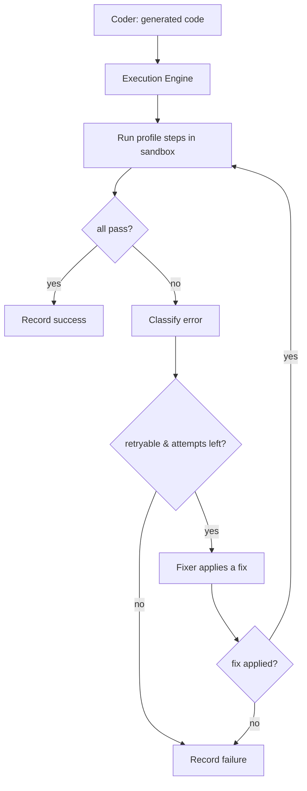

# Autonomous Execution & Docker Sandboxing

This is where ForgeAI stops being "generate code" and becomes "generate → run →
test → debug → fix → verify". The AI verifies its own work inside isolated
containers and self-corrects when things fail.

**Source:** `packages/execution/`.

## The loop



## Components

| Component | Responsibility |
|-----------|----------------|
| **Sandbox** | Where commands run. `DockerSandbox` (isolated), `LocalSandbox` (host fallback), `FakeSandbox` (tests). |
| **ExecutionEngine** | Orchestrates run → classify → fix → retry over a profile. |
| **ExecutionProfile** | The build/test/lint commands per framework — the AI doesn't guess. |
| **Error classifier** | Turns logs into a typed error + fix strategy. |
| **RetryManager** | Bounds retries (never forever). |
| **LogCollector / ArtifactManager** | Capture every command result + artifacts → traceable run history. |
| **ApprovalGate** | Human approval for destructive actions. |
| **Security** | Blocked-command rules + resource limits. |

## Sandboxes (offline-first)

Mirrors the Phase 4 pattern — the whole loop is testable with **no Docker
daemon** (ADR-0016):

| Sandbox | Use | Isolated? |
|---------|-----|-----------|
| `DockerSandbox` | production | ✅ container, `--network none`, mem/CPU-capped, disposable |
| `LocalSandbox` | degraded fallback when Docker is down | ❌ host, but timeout + blocked-command enforced |
| `FakeSandbox` | tests — scripts "fail twice then pass" | n/a |

A `DockerSandbox` creates a detached container on `setup()`, runs each command
with `docker exec`, and `kill`s it on `teardown()` — fresh environment per task.

## Execution profiles

```jsonc
// fastapi                          // nextjs
{ "test": "pytest -q",             { "build": "pnpm build",
  "build": "python -m py_compile",   "test": "pnpm test",
  "lint": "ruff check ." }           "lint": "pnpm lint" }
```

`profile_for_project(root)` detects the framework (via `memory.detection`) and
returns the right commands.

## Error classification → fix strategy

| Category | Example | Strategy |
|----------|---------|----------|
| `dependency` | `ModuleNotFoundError: 'jwt'` | add the package, reinstall, retry |
| `syntax` | `SyntaxError` | fix the reported syntax |
| `test_failure` | `AssertionError: expected 200` | fix code/test so it passes |
| `runtime` | `NoneType` traceback | diagnose & fix the cause |
| `security` | secret in output | **not retryable** — remove the secret |
| `timeout` | killed at limit | reduce work / check infinite loop |

The classifier extracts a **hint** (e.g. the missing module name) the fixer uses.

## Self-correction (Reflection Engine)

The engine is decoupled from *how* fixes are made: it calls an injected
**fixer** (the Reflection/Coder agents) with the classified error + logs. The
fixer returns `True` if it changed something worth retrying. Security errors are
never retried; everything else retries up to `MAX_RETRIES` (default 3).

> Worked example: `import jwt` → build fails `ModuleNotFoundError: 'jwt'` →
> classified `dependency` (hint `jwt`) → fixer adds `pyjwt` → retry → pass.
> (Verified in `test_execution_engine.py::test_self_correcting_loop_recovers`.)

## Security

- **Blocked commands** (always, even in a container): `rm -rf /`, `sudo`,
  `chmod 777`, `shutdown`, `reboot`, fork bombs, `curl … | sh`, raw-disk writes.
- **Resource limits**: CPU, memory, timeout per sandbox (defaults 2 CPU / 2 GB /
  300 s).
- **Human approval gates**: delete files, git push, merge PR, deploy — denied by
  default; a run can auto-approve specific actions in trusted contexts.

See [security.md](security.md).

## Run history

Every run produces a `RunRecord` (task, success, retries, duration, per-command
results, artifacts) — the basis for the Execution panel in the UI and for
debugging.

## Integration

The **Execution agent** runs the engine when `build_workflow(..., engine_factory=…)`
is wired; otherwise it simulates so the offline default workflow still runs.

## Spec

Binding contract: [`../specs/execution-spec.md`](../specs/execution-spec.md).
