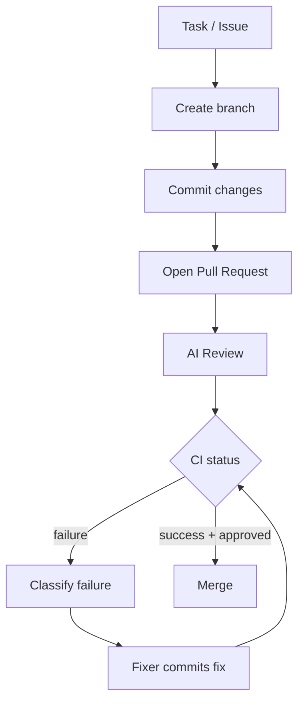
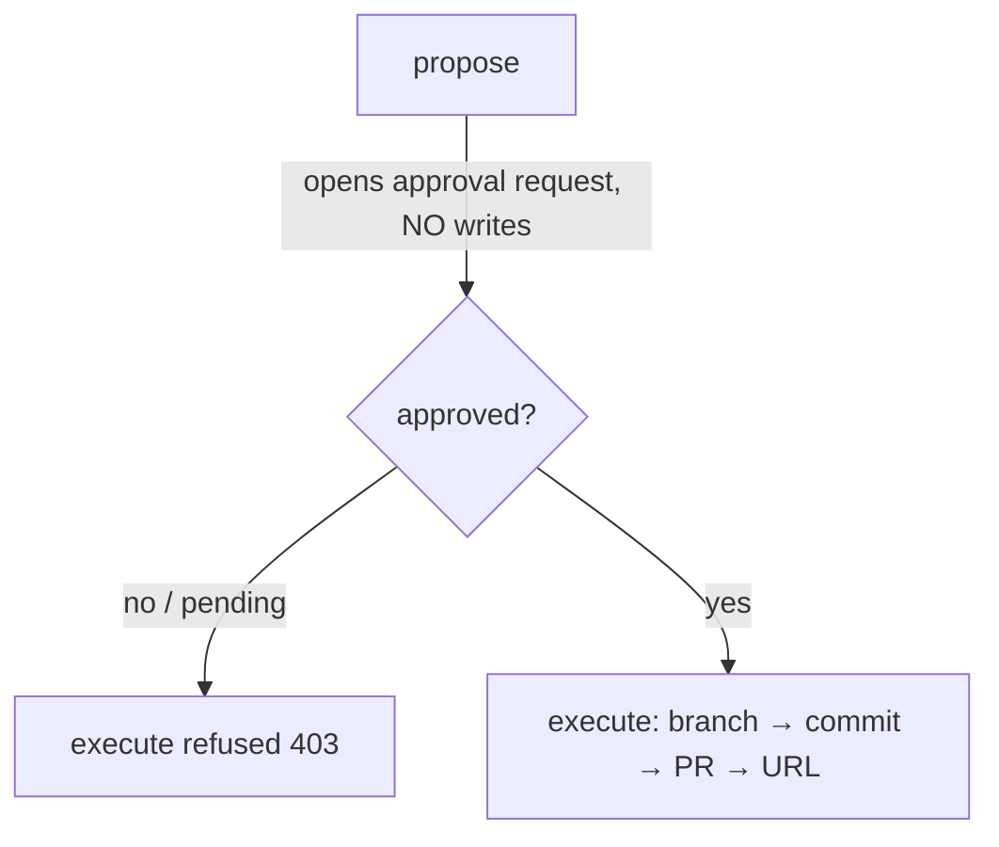

# GitHub Integration & Autonomous Development Workflow

Phase 8 makes ForgeAI a real development teammate: it branches, commits, opens
PRs, reviews, watches CI, fixes failures, and merges — like a junior engineer.

**Source:** `packages/github/`.

## The workflow



## Provider abstraction

`GitHubProvider` is the single integration seam. Two backends (ADR-0019):

| Provider | Use |
|----------|-----|
| `RestGitHubProvider` | real GitHub REST API via httpx + Personal Access Token |
| `FakeGitHubProvider` | in-memory simulation — deterministic, **offline tests** |

The fake models the full lifecycle (branches, commits, PRs, reviews, CI) and can
**script CI outcomes** ("fail once, then pass"), so the autonomous loop is
testable with no token and no network.

**Auth:** `GITHUB_TOKEN` (classic PAT, `repo` scope) for the MVP. Blank = GitHub
features disabled.

## Services

| Service | Does |
|---------|------|
| `BranchService` | conventional branch names: `feature/…`, `fix/…`, `docs/…` |
| `CommitService` | commits to a branch (never to the default branch directly) |
| `PullRequestService` | opens PRs with a structured body; merges |
| `CIService` | polls checks once per cycle; classifies failures (Phase 5 classifier) |

### PR description (auto-generated)

```
## Summary
<what & why>
## Changes
- <change>
## Testing
<commands + result>
```

## GitHubManager — the autonomous loop

`run_task(...)` runs the end-to-end workflow for one task:

1. **Branch** — `feature/<slug>` off the default branch.
2. **Commit** — only validated code (build/tests/review upstream).
3. **Open PR** — structured title + body.
4. **Review** — an injected reviewer posts approve / request-changes with
   inline comments (security, performance, naming, …).
5. **Watch CI** — poll status; on failure, classify and call the injected
   **fixer**, commit the fix, re-run — bounded by `max_ci_retries`.
6. **Merge** — only when `auto_merge` **and** CI is green **and** review approved.

Like the Phase 5 ExecutionEngine, the reviewer and CI fixer are **injected**
(the agents supply them), so the manager is decoupled and offline-testable. It
returns a `WorkflowResult` with a **git timeline** — great for demos:

```
Created branch feature/add-jwt-auth | Committed: feat(auth): add JWT |
Opened PR #1 | Review: approved | CI failed: dependency |
Pushed CI fix (attempt 1); re-running | CI passed | Merged PR #1
```

## CI failure analysis

CI logs run through the **Phase 5 error classifier**: a `ModuleNotFoundError`
becomes a `dependency` error with the missing module as a hint, which the fixer
acts on. Security errors are never auto-retried.

## Safety

- Agents **never commit to the default branch** — always a task branch.
- Merge requires green CI **and** an approving review.
- Force-push, deleting `main`, and history rewrites are out of scope / blocked.
- Destructive actions (merge, delete branch, deploy) flow through the Phase 6/7
  human approval gates.

## Repository sync & knowledge

On repo changes: pull → re-index → update memory/RAG (Phase 4), so ForgeAI stays
aware of the codebase. Commits, branches, PRs, issues, and reviews become a
searchable **git knowledge layer**, and PR discussions become memory ("why was
this designed this way?").

## Issues → tasks

GitHub issues are listed via the provider and become Planner tasks, enabling the
future fully-autonomous loop: *Issue → Planner → Coder → Tests → PR → Review*.

## Authoring commits — local clone, not REST (ADR-0020)

ForgeAI authors commits the way an engineer does, via `LocalRepository`:

```
clone → create branch → write files (sandboxed) → git add/commit → push
```

This composes naturally with the Docker sandbox (run/test the clone), Reflection
(fix in place), Review, and CI (push triggers checks). The REST provider handles
only refs/PRs/reviews/checks — its `create_commit` is deliberately
`NotImplementedError`. Verified offline using a **bare local remote** (no token).

## Hardening (Phase 8.1)

Real GitHub differs from the fake in ways the fake can't surface — these are
built and unit-tested with a mock transport:

- **Rate limits** — `request_with_backoff` honors `Retry-After` /
  `X-RateLimit-Reset` on 403/429 and backs off (bounded), then returns.
- **Pagination** — `paginate` follows `Link: rel="next"` across pages (bounded
  by `max_pages`), so 1000-PR / 10000-commit repos are handled.
- **Webhooks** — `verify_signature` (HMAC `X-Hub-Signature-256`) + `map_webhook`
  turn GitHub events into ForgeAI `Event`s, so a failed-check webhook can trigger
  the CI fix loop by **push instead of poll**.

## Data model (planned tables)

`repositories`, `branches`, `commits`, `pull_requests`, `reviews`, `ci_runs` —
persisted via the Phase 7 async DB layer.

## Going live (real GitHub)

The provider is selected automatically from configuration — no code change:

```
GITHUB_TOKEN set  → RestGitHubProvider (real GitHub)
GITHUB_TOKEN empty → FakeGitHubProvider (offline, default)
```

`apps/api/app/github_runtime.py` is the seam (`build_provider()` /
`build_manager()`); agents and workflows are untouched. Live read endpoints to
demo it:

| Endpoint | Shows |
|----------|-------|
| `GET /github/status` | `{"mode":"live"}` or `{"mode":"fake"}` |
| `GET /github/repo/{owner}/{name}` | repo info |
| `GET /github/repo/{owner}/{name}/branches` | branches |
| `GET /github/repo/{owner}/{name}/issues` | open issues (Issue→task source) |
| `GET /github/repo/{owner}/{name}/pulls/{n}` | a pull request |

```bash
# Flip to live: add a fine-grained PAT (repo scope) to .env, restart, then:
curl localhost:8000/github/status                      # {"mode":"live"}
curl localhost:8000/github/repo/octocat/Hello-World    # real repo data
```

## Approval-gated PR workflow (Phase 8.2)

ForgeAI never silently writes to GitHub. The write path is a **two-phase,
human-gated** flow (`GitHubWorkflow` + `ApprovalService`):



- **`propose(repo, plan)`** — records what *will* happen and opens an approval
  request. **Writes nothing** to GitHub.
- A human **approves** or **rejects** (`ApprovalService.approve/reject`).
- **`execute(repo, plan, request_id)`** — creates the branch, commit, and PR and
  returns the PR URL — but **only if the request is approved**; otherwise it
  raises (the API returns `403`).

This is the safer governance story: an agent drafts a PR proposal, a human
approves, *then* the PR is created. (ADR-0023)

Discrete, composable manager operations back it:
`create_branch()`, `create_commit()`, `create_pr()`, `get_review_status()`,
`sync_repository()`.

### Wired into the agent pipeline

The **Git agent** uses this workflow: after a run, `build_workflow(...,
github_workflow=, github_repo=)` makes the Git agent call `propose()` with a
`PRPlan` built from the generated code. The run ends with a **pending approval**
(`state.pr_approval_id`) and **no PR written** — a human approves, then executes.
So the autonomous pipeline drafts the PR; the human gate stays in force.

### API (demo flow)

```bash
# 1. Propose — returns an approval_id; writes nothing
curl -s -X POST localhost:8000/github/pr/propose -H 'Content-Type: application/json' \
  -d '{"owner":"you","name":"sandbox","task":"Add JWT auth",
       "commit_message":"feat(auth): add JWT","files":{"auth.py":"import jwt"},
       "pr_title":"feat(auth): JWT authentication"}'

# 2. Executing now is refused (403) — not yet approved
# 3. Approve, then execute → PR created with a URL
curl -s -X POST localhost:8000/github/pr/<approval_id>/approve
curl -s -X POST localhost:8000/github/pr/<approval_id>/execute -H 'Content-Type: application/json' -d '{...same body...}'
```

| Endpoint | Effect |
|----------|--------|
| `POST /github/pr/propose` | open approval request (no writes) |
| `GET /github/pr/pending` | list pending proposals (Approval Center data) |
| `GET /github/pr/{id}/diff` | proposed file contents (Diff Viewer) |
| `POST /github/pr/{id}/approve` | approve a proposal |
| `POST /github/pr/{id}/reject` | reject a proposal |
| `POST /github/pr/{id}/execute` | create the PR (403 unless approved; id-only) |

### Approval Center UI (Phase 11)

The **PR Approval Center** (`apps/web` `/workspace`) is the UI centerpiece:
pending proposals from the agent pipeline, each with **Review** (inline diff
viewer), **Approve** (one-click → executes the workflow → shows the PR URL), and
**Reject**. The proposal's plan is stored server-side, so approve+execute needs
only the `approval_id`. Nothing reaches GitHub without an explicit Approve.

## Live validation

Offline tests cover all logic via the fake provider. Real GitHub is validated
**separately against a sandbox repo** (never production) with
`scripts/verify-github.sh`, which checks token identity, repo/read/write/PR
scopes, pagination headers, rate-limit headers, and a full
clone→branch→commit→push→PR→close cycle. Requires a valid `GITHUB_TOKEN`.

## Spec

Binding contract: [`../specs/github-spec.md`](../specs/github-spec.md).
