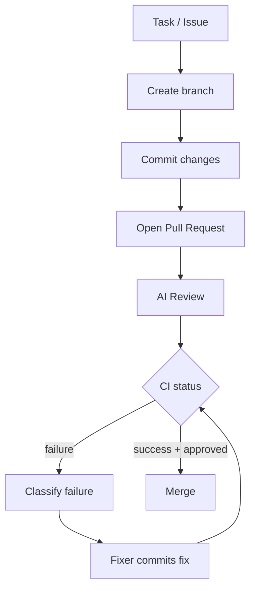

# GitHub Integration & Autonomous Development Workflow

Phase 8 makes ForgeAI a real development teammate: it branches, commits, opens
PRs, reviews, watches CI, fixes failures, and merges — like a junior engineer.

**Source:** `packages/github/`.

## The workflow



## Provider abstraction

`GitHubProvider` is the single integration seam. Two backends (ADR-0019):

| Provider | Use |
|----------|-----|
| `RestGitHubProvider` | real GitHub REST API via httpx + Personal Access Token |
| `FakeGitHubProvider` | in-memory simulation — deterministic, **offline tests** |

The fake models the full lifecycle (branches, commits, PRs, reviews, CI) and can
**script CI outcomes** ("fail once, then pass"), so the autonomous loop is
testable with no token and no network.

**Auth:** `GITHUB_TOKEN` (classic PAT, `repo` scope) for the MVP. Blank = GitHub
features disabled.

## Services

| Service | Does |
|---------|------|
| `BranchService` | conventional branch names: `feature/…`, `fix/…`, `docs/…` |
| `CommitService` | commits to a branch (never to the default branch directly) |
| `PullRequestService` | opens PRs with a structured body; merges |
| `CIService` | polls checks once per cycle; classifies failures (Phase 5 classifier) |

### PR description (auto-generated)

```
## Summary
<what & why>
## Changes
- <change>
## Testing
<commands + result>
```

## GitHubManager — the autonomous loop

`run_task(...)` runs the end-to-end workflow for one task:

1. **Branch** — `feature/<slug>` off the default branch.
2. **Commit** — only validated code (build/tests/review upstream).
3. **Open PR** — structured title + body.
4. **Review** — an injected reviewer posts approve / request-changes with
   inline comments (security, performance, naming, …).
5. **Watch CI** — poll status; on failure, classify and call the injected
   **fixer**, commit the fix, re-run — bounded by `max_ci_retries`.
6. **Merge** — only when `auto_merge` **and** CI is green **and** review approved.

Like the Phase 5 ExecutionEngine, the reviewer and CI fixer are **injected**
(the agents supply them), so the manager is decoupled and offline-testable. It
returns a `WorkflowResult` with a **git timeline** — great for demos:

```
Created branch feature/add-jwt-auth | Committed: feat(auth): add JWT |
Opened PR #1 | Review: approved | CI failed: dependency |
Pushed CI fix (attempt 1); re-running | CI passed | Merged PR #1
```

## CI failure analysis

CI logs run through the **Phase 5 error classifier**: a `ModuleNotFoundError`
becomes a `dependency` error with the missing module as a hint, which the fixer
acts on. Security errors are never auto-retried.

## Safety

- Agents **never commit to the default branch** — always a task branch.
- Merge requires green CI **and** an approving review.
- Force-push, deleting `main`, and history rewrites are out of scope / blocked.
- Destructive actions (merge, delete branch, deploy) flow through the Phase 6/7
  human approval gates.

## Repository sync & knowledge

On repo changes: pull → re-index → update memory/RAG (Phase 4), so ForgeAI stays
aware of the codebase. Commits, branches, PRs, issues, and reviews become a
searchable **git knowledge layer**, and PR discussions become memory ("why was
this designed this way?").

## Issues → tasks

GitHub issues are listed via the provider and become Planner tasks, enabling the
future fully-autonomous loop: *Issue → Planner → Coder → Tests → PR → Review*.

## Data model (planned tables)

`repositories`, `branches`, `commits`, `pull_requests`, `reviews`, `ci_runs` —
persisted via the Phase 7 async DB layer.

## Spec

Binding contract: [`../specs/github-spec.md`](../specs/github-spec.md).
