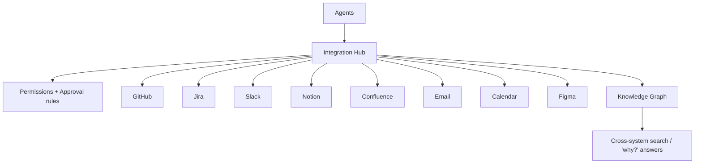

# Enterprise Integrations & External Tool Ecosystem

Phase 9 lets ForgeAI operate across the whole engineering org — not just code.
It can read work (Jira, Notion, Confluence), communicate (Slack, Email), and
connect everything into one searchable knowledge layer.

**Source:** `packages/integrations/`.

## Architecture



Agents never touch a vendor SDK directly — everything goes through the
**Integration Hub** (same pattern as the Tool Manager and Model Router).

## Connector abstraction

Every system is a `Connector` exposing `search`/`get`/`create`/`update` over a
normalized `ExternalObject` (with a cross-system `ref` like `jira:JIRA-142`,
`github:pr/91`). One interface ⇒ all systems are treated alike and any connector
is replaceable.

| System | Read | Write | Notes |
|--------|------|-------|-------|
| GitHub | ✅ | ✅ | (Phase 8 has the deep integration) |
| Jira | ✅ | ✅ | read/plan/update issues; create bug tickets |
| Slack | ✅ | ✅ | notifications, threads |
| Notion | ✅ | ✅ | read RFCs/design; write docs after a feature |
| Confluence | ✅ | — | search runbooks, meeting notes, internal KB |
| Email | — | ✅ | send-only (summaries, approvals) |
| Calendar | ✅ | — | read events (sprint planning context) |
| Figma | ✅ | — | read-only initially (design → code later) |

Offline `Fake*` connectors back the whole suite; production connectors (httpx
per vendor) implement the same interface and drop in unchanged (ADR-0021).

## Integration Hub

`IntegrationHub` registers connectors and enforces policy on every call:

- `read(system, ref, agent=…)` / `write(system, kind, agent=…, **fields)`
- `search(query, systems=…)` — **cross-system** search
- `answer(question)` — gather evidence from every system + graph-related refs

## Security

- **Connector permissions** — per-agent allow-list of `(system, capability)`.
  Not every agent gets everything: Research *reads* Notion/Confluence; the
  Notification agent *writes* Slack; the Git agent *writes* GitHub.
- **Approval rules** — sensitive writes (send Email, create Jira ticket, update
  production Notion/Confluence docs) require human approval before executing.
- **Secret management** — integration secrets are encrypted at rest
  (`SecretStore`, Fernet); never stored in plaintext.

## Unified knowledge layer

Memory now spans every system. The **knowledge graph** links cross-system refs:

```
JIRA-142 ──implements──▶ PR #91 ──documents──▶ Notion RFC
                              └──discusses──▶ Slack thread
```

`graph.related(ref)` walks multiple hops, so a question like *"Why was JWT
chosen?"* gathers evidence from the PR, the Jira ticket, the Slack discussion,
and the RFC — **cross-system retrieval** in one answer.

## Workflow automation (enabled)

With events from every system, the autonomous loop extends end-to-end:

```
New Jira ticket → Planner → branch → implement → PR → update Jira → notify Slack
```

## Data model (planned tables)

`integrations` (type, workspace, encrypted_secret), `external_objects`
(jira_issue / slack_message / notion_page / github_pr), `knowledge_graph`
(source, target, relationship) — persisted via the Phase 7 async DB layer.

## Spec

Binding contract: [`../specs/integrations-spec.md`](../specs/integrations-spec.md).
