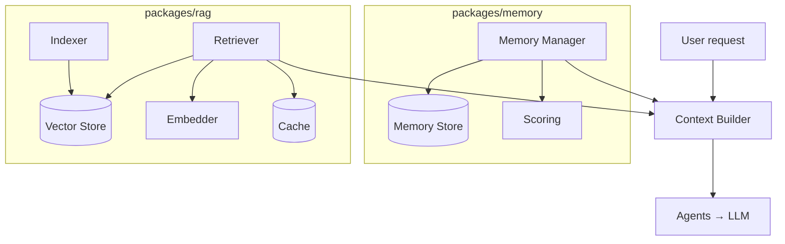

# Memory, RAG & Knowledge Engine

This is what makes ForgeAI **project-aware** instead of just prompt-aware. Ask
two tools "add dark mode": a plain assistant reads a few files and guesses;
ForgeAI recalls that you use Tailwind + Zustand + TypeScript, already have a
`ThemeProvider`, and renamed `Navbar` to `Header` last week.

**Source:** `packages/memory/` (memory) and `packages/rag/` (retrieval).

## Two subsystems, one goal



Everything has an **offline backend** (so the whole engine is testable without
Ollama/Qdrant/Redis) and a **production backend**, selected by a factory in the
API (ADR-0015):

| Concern    | Offline (tests)        | Production            |
|------------|------------------------|-----------------------|
| Embeddings | `HashingEmbedder`      | `OllamaEmbedder` (nomic-embed-text) |
| Vectors    | `InMemoryVectorStore`  | `QdrantVectorStore`   |
| Cache      | `InMemoryCache`        | `RedisCache`          |
| Memory     | `InMemoryStore`        | PostgreSQL (DB phase) |

## The four memory types

| Scope | Lifetime | Stores | Example |
|-------|----------|--------|---------|
| **Session** | one conversation | current task, files, errors, messages | "earlier we built the login API" |
| **Project** | forever | framework, structure, naming, libraries, API contracts | "this project uses FastAPI + Alembic" |
| **User** | forever | preferences | "prefers pnpm, Black, Prettier" |
| **Knowledge** | forever | documents (README, RFCs, design docs) | searchable docs |

All four go through one **Memory Manager** — no agent touches the store (or
PostgreSQL) directly. It owns `store / retrieve / summarize / compress` and a
logical "tick" clock used for scoring.

## RAG pipeline

```
files → chunk (≈800 words, 100 overlap) → embed → vector store
query → embed → (cache?) → vector search → ranked chunks → Context Builder
```

- **Indexer** walks the project, skips noise (`node_modules`, `.git`, `dist`,
  `.venv`, …), indexes source/config/docs, and tags each chunk with provenance
  (`project`, `file`, `language`, `chunk`, `hash`).
- **Incremental:** a per-file content hash means unchanged files are skipped and
  only changed files are re-embedded.
- **Semantic retrieval:** "Where do we validate JWT?" finds `verify_token()` by
  *meaning*, not filename (verified in `test_rag_pipeline.py`).
- **Caching:** repeated queries are served from the cache instead of re-hitting
  the vector store.

## Context Builder

Rather than dumping everything into the prompt, it assembles a small,
high-value context:

```
relevant files (RAG) + project notes + user preferences + recent conversation
```

It pulls scored memories from the Memory Manager and RAG hits from the
Retriever, then truncates to a character budget. Result: smaller prompts, better
responses. The **Memory agent** calls it and writes the result into
`state.project_context` for downstream agents.

## Memory scoring

Each memory is ranked by **recency** (exponential decay over ticks),
**importance** (caller-assigned), **usage frequency** (log-scaled), and
**project relevance** (bonus for the active project). The Context Builder takes
the highest-scoring items per scope.

## Conversation compression

Long sessions get expensive. `compress_session()` summarizes the oldest items,
stores the summary, and deletes the details — keeping the most recent N intact.

## Automatic project understanding

`detect_project()` reads manifests (`package.json`, `pyproject.toml`, lockfiles)
to infer languages, frameworks (Next, React, FastAPI, …), and package managers,
so agents don't need the stack explained.

## Specs

The binding contracts are in [`../specs/memory-spec.md`](../specs/memory-spec.md)
and [`../specs/rag-spec.md`](../specs/rag-spec.md).
