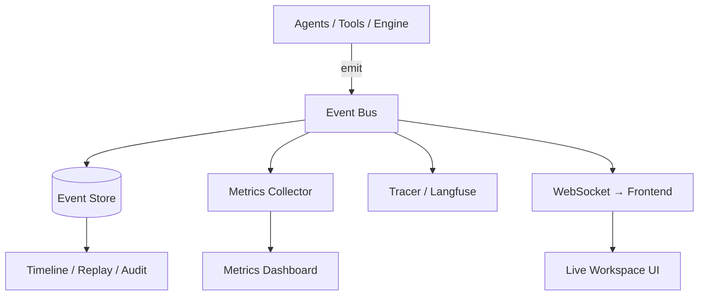

# Developer Workspace & Observability

Phase 6 makes ForgeAI **transparent**: you can see what agent is working, what
tool is running, what changed, why, what failed, and how it was fixed — live.
Think Cursor + GitHub Actions + LangSmith in one view.

**Source:** `packages/observability/` (backend), `apps/web/src` (frontend).

## Event-driven architecture

Every action becomes an `Event` on the `EventBus`, which fans out to four
consumers:

- The bus assigns each event a monotonic **tick** → deterministic ordering and
  **replay** without relying on wall-clock time.
- A failing subscriber never breaks publishing or the other subscribers.
- Subscribers may be sync or async.

## Events

`EventType` covers the run lifecycle (`run.started/completed`), agents
(`agent.started/completed/failed`), tools (`tool.started/completed`), execution
(`build.failed/passed`, `reflection.started`), memory/RAG (`memory.retrieved`,
`rag.retrieved`), file changes, approvals, and notifications.

## How agents emit events

`build_workflow(router, bus=…)` wraps each node so it emits
`agent.started` → run → `agent.completed` (or `agent.failed`), timing each node.
With **no bus** the wrapper is a no-op — the offline default workflow is
unchanged (backward compatible). `run_workflow` brackets the whole run with
`run.started` / `run.completed`.

## Backend components

| Component | Powers |
|-----------|--------|
| `EventBus` | pub/sub fan-out with monotonic ticks |
| `EventStore` | timeline, replay, audit trail |
| `MetricsCollector` | per-agent / per-tool / per-task / token+cost dashboard |
| `Tracer` (`Null` / `Langfuse`) | prompt/output/latency traces |
| `HumanApprovalCenter` | pause-for-approval loop + approval events |

## API

| Endpoint | Purpose |
|----------|---------|
| `GET /observability/metrics` | dashboard snapshot |
| `GET /observability/timeline/{run_id}` | ordered events for a run (replay) |
| `GET /observability/audit/{run_id}` | flat audit trail |
| `WS /observability/live` | real-time event stream (no polling) |

A run via `POST /agents/run` publishes to the process-wide bus, so the timeline,
metrics, and live WebSocket all reflect it (verified end-to-end in
`test_observability_api.py`).

## Frontend — the Workspace

`/workspace` is the live observability screen, driven by the event WebSocket:

- **Agent status** — per-agent ✓/⟳/… derived from the stream.
- **Agent Timeline ⭐** — ordered, color-coded events as they arrive.
- **Metrics panel** — tasks, success rate, per-agent stats.

The `useEventStream` hook holds the WebSocket; components are pure functions of
the event list. The frontend builds clean (`/workspace` route).

## Metrics & cost

Per-agent success rate + avg duration, per-tool calls/failures, task success
rate, and **token/cost totals** — tracked even though the MVP uses free local
models, so switching to a paid provider later needs no new plumbing.

## Human approval center

When an agent wants to delete files, push, merge, or deploy, the center opens an
`ApprovalRequest`, emits `approval.requested` (UI prompts), and blocks until a
human resolves it (`approval.resolved`). This is the event-driven companion to
the Phase 5 `ApprovalGate` (which decides *what* needs approval).

## Offline-first (ADR-0017)

`NullTracer` + in-memory `EventStore` mean the whole system is testable with no
Langfuse and no database. Langfuse and the PostgreSQL-backed store drop in
behind the same interfaces.

## Spec

Binding contract: [`../specs/observability-spec.md`](../specs/observability-spec.md).
