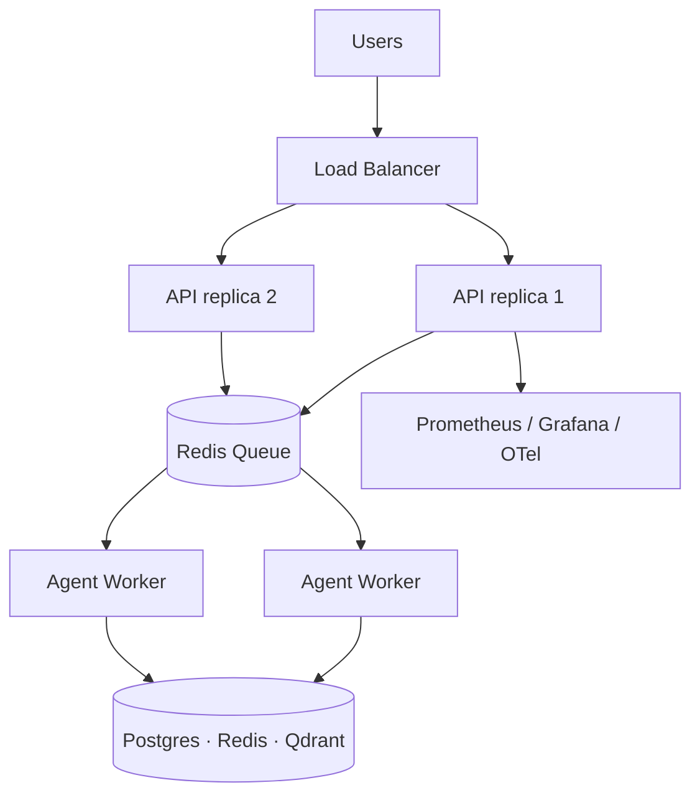

# Production Deployment, Scale, Security & Reliability

Phase 10 turns ForgeAI from a dev system into a **production platform** that
handles many orgs, hundreds of projects, and thousands of agent runs without
breaking. The focus shifts from features to reliability, scalability, security,
performance, and operations.

**Source:** `packages/runtime/` + the production endpoints in `apps/api`.

## Production architecture

The key shift: **1000 requests → queue → workers → results**, instead of one
blocking request per agent.

## Queue + worker pool (ADR-0022)

`JobQueue` decouples the API from long-running agent work: enqueue → workers
process with bounded concurrency → retry → dead-letter. The interface mirrors
Celery/RQ; an in-memory backend backs offline tests, Celery/Redis in production.

- Non-blocking, scalable, retryable, schedulable.
- `depth` exposes queue length (a key scaling metric).

## Reliability

| Primitive | Purpose |
|-----------|---------|
| `RetryPolicy` + `run_with_retry` | bounded exponential backoff on transient failures |
| `CircuitBreaker` | trip OPEN after N failures, fail fast, probe HALF_OPEN, recover |
| `DeadLetterQueue` | quarantine jobs that exhausted retries, for debugging |

All use injected clocks/sleeps → deterministic, instant tests.

## Performance & scale

- **Multi-agent parallelism** — `run_parallel` splits a task into lanes
  (frontend / backend / database), runs them concurrently (bounded), and
  `merge_results` combines them; a failing lane doesn't sink the others.
- **Connection pooling / indexes** — async SQLAlchemy engine pooling (Phase 7);
  indexes documented in [database.md](database.md).
- **Caching** — Redis-backed retrieval cache (Phase 4).

## Security

- **Rate limiting** — `RateLimiter` (token bucket per user/org) protects the API
  and expensive runs.
- **Secret management** — integration secrets encrypted at rest (Phase 9
  `SecretStore`); app secrets via env, never in code.
- **Sandbox hardening** — Docker with CPU/memory/timeout limits and
  `--network none` (Phase 5); **`NetworkPolicy`** allow-lists the domains agents
  may reach (deny by default: github.com, pypi.org, …).
- **Multi-tenant isolation** — enforced at the DB, API, memory, and vector
  levels (Phase 7 RBAC + workspace isolation).
- **Audit trail** — every significant action recorded (Phase 6/7).

## Operations

- **Health** — `/health` (liveness, cheap) and `/health/ready` (readiness:
  aggregates dependency checks → healthy / degraded / unhealthy).
- **Metrics** — `/metrics` in Prometheus text format (`MetricsRegistry`:
  counters, gauges, histograms — agent runs, queue depth, latency, errors).
- **Dashboards / tracing** — Grafana over Prometheus; OpenTelemetry / Loki for
  centralized logs and end-to-end traces (wiring is deployment config).
- **Feature flags** — `FeatureFlags` toggles experimental agents/models/tools
  per workspace without redeploying.

## Production readiness checklist

| Area | Status |
|------|--------|
| Queue + worker pool | ✅ implemented + tested |
| Retry / circuit breaker / DLQ | ✅ implemented + tested |
| Rate limiting | ✅ implemented + tested |
| Health + readiness + Prometheus metrics | ✅ implemented + tested |
| Feature flags | ✅ implemented + tested |
| Network policy (egress allow-list) | ✅ implemented + tested |
| Multi-agent parallelism | ✅ implemented + tested |
| Multi-tenant isolation | ✅ (Phase 7) |
| Secret encryption | ✅ (Phase 9) |
| Sandbox limits | ✅ (Phase 5) |
| Celery/Redis, Prometheus/Grafana, K8s wiring | 🔌 interfaces ready; live infra is deploy-time |
| Backups / disaster recovery | 📋 documented procedures (deploy-time) |

## Spec

Binding contract: [`../specs/production-spec.md`](../specs/production-spec.md).
See also [deployment.md](deployment.md) for the deploy topology.
