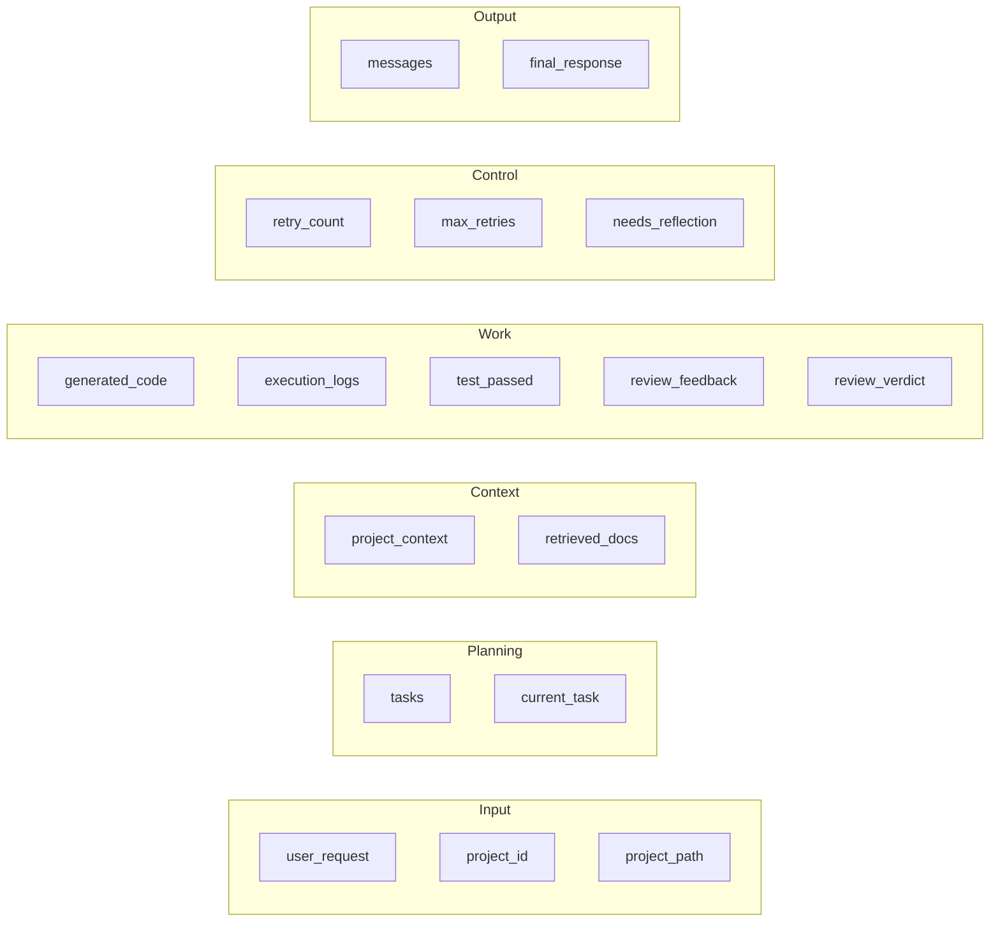

# Shared State — `ProjectState`

The single most important data structure in ForgeAI. Every agent reads from and
writes to one `ProjectState` instance threaded through the LangGraph workflow,
instead of passing dozens of variables around (ADR-0010).

**Source of truth:** `packages/core/state.py`.

## Fields

### Read/write matrix

| Field             | Type                  | Written by            | Read by                       |
|-------------------|-----------------------|-----------------------|-------------------------------|
| `user_request`    | `str`                 | caller (API)          | all                           |
| `project_id`      | `str \| None`         | caller                | Memory, Git                   |
| `project_path`    | `str \| None`         | caller                | Coder, Execution, Git         |
| `tasks`           | `list[TaskSpec]`      | Planner               | Manager, Coder                |
| `current_task`    | `TaskSpec \| None`    | Planner               | most agents (for `task_id`)   |
| `project_context` | `str`                 | Memory                | Researcher, Coder             |
| `retrieved_docs`  | `list[str]`           | Researcher            | Coder                         |
| `generated_code`  | `dict[str,str]`       | Coder                 | Execution, Review, Git        |
| `execution_logs`  | `list[str]`           | Execution, Testing, Reflection | Testing, Reflection, Manager |
| `test_passed`     | `bool \| None`        | Testing (reset by Reflection) | Review                |
| `review_feedback` | `str`                 | Review, Reflection    | Coder, Reflection             |
| `review_verdict`  | `ReviewVerdict`       | Review                | workflow edge, Manager        |
| `retry_count`     | `int`                 | Reflection            | workflow edge, Manager        |
| `max_retries`     | `int` (default 2)     | caller                | workflow edge                 |
| `needs_reflection`| `bool`                | Review/Reflection     | (advisory)                    |
| `messages`        | `list[AgentMessage]`  | all (via `record()`)  | Manager, API, observability   |
| `final_response`  | `str`                 | Manager               | API → user                    |

## Lifecycle rules

- **One writer per field per step.** Agents append to lists (`record()`,
  `execution_logs`) rather than overwrite, preserving the audit trail.
- **`messages` is append-only.** It is the complete, ordered record of who did
  what — the basis for the Logs UI and observability.
- **Control fields drive routing.** `review_verdict` + `retry_count` +
  `max_retries` are read by the workflow's conditional edge, not by an agent
  calling another agent.
- **Reflection resets `test_passed` to `None`** so the retried run is evaluated
  fresh.

## Why one shared object

- Explicit, auditable data flow (vs. hidden argument passing).
- Loose coupling — agents coordinate only through state, never direct calls.
- Each agent is independently unit-testable: construct a state, run the agent,
  assert on the mutated state.

See the formal contract in [`../specs/state-spec.md`](../specs/state-spec.md).
