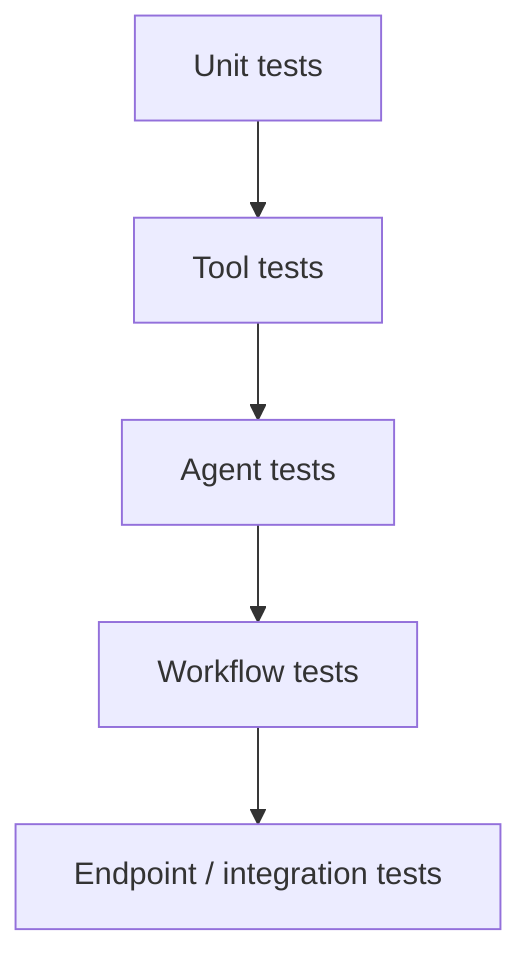

# Testing Strategy

ForgeAI is tested from the smallest unit up to the whole agent workflow. A core
principle: **the entire system must be testable offline** — no live LLM, no
pulled models, no external services — via the `EchoProvider` (ADR-0011).

## The pyramid



| Layer | What it covers | Example (today) |
|-------|----------------|-----------------|
| **Unit** | Pure logic, contracts, the Model Router | `test_model_router.py` |
| **Tool** | Each tool's actions, errors, permissions | `test_filesystem_tool.py` (incl. path-escape) |
| **Agent** | One agent against a constructed state | (per-agent, growing) |
| **Workflow** | The full LangGraph graph end-to-end, incl. reflection loop | `test_workflow.py` |
| **Endpoint** | HTTP contract of the API | `test_agents_endpoint.py`, `test_health.py` |

## How offline testing works

The `echo_router` fixture (`tests/conftest.py`) wires a `ModelRouter` to the
`EchoProvider`. Because agents depend only on the router (ADR-0003), the whole
graph runs deterministically with no network. Tests assert on **plumbing and
control flow** (routing, state transitions, the reflection retry, the audit
trail) — not on LLM output quality.

> Model/output **quality** is a separate concern, measured by the evaluation
> harness in [`../specs/evaluation-spec.md`](../specs/evaluation-spec.md).

## Running

```bash
cd apps/api
uv run pytest -q            # all tests
uv run pytest -q -k workflow
```

Lint/format are part of "done":

```bash
uv run ruff check ../../packages .
uv run black --check ../../packages .
```

## Invariants we assert

- The Manager never writes code (`test_manager_never_writes_code`).
- The reflection loop triggers on failure and the run still terminates.
- Every specialist appears in the audit trail on the happy path.
- The Filesystem tool blocks path escapes.

## Coverage goals

| Area | Target |
|------|--------|
| `core` contracts & state | 100% |
| Tools | 90%+ (every action + error path) |
| Agents | each agent has at least one direct test |
| Workflow | happy path + each branch (approve / reflect / exhausted) |

CI runs the suite plus ruff and black on every change ([contributing.md](contributing.md)).
