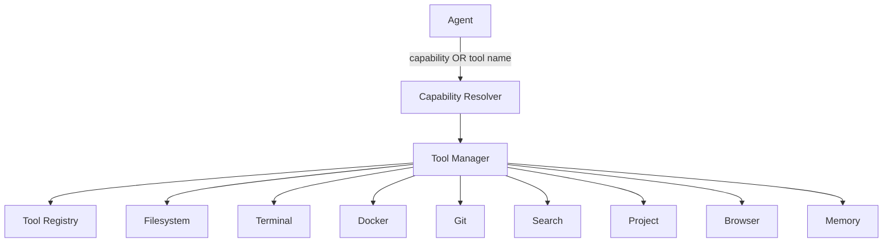

# Tools — the Action Engine

Tools are what turn ForgeAI from a text generator into an autonomous engineering
platform. Without tools an LLM can only produce text; with tools it can read
code, edit files, run commands, use git, search, and more.

Agents never touch the OS directly. Every action goes through the **Tool
Manager**, and agents may instead declare a **capability** and let the system
pick the tool.

**Source of truth:** `packages/tools/`.



## The lifecycle (every tool, no exceptions)

The Tool Manager runs the **same** steps for every call:

```
request → validation → permission check → execution → logging → ToolResult
```

The tool itself only does step "execution"; timing, permission enforcement, and
logging belong to the Manager, so tools stay simple and uniform.

## Contracts

Every tool implements one interface and returns one result shape.

```python
class Tool:
    name: str
    description: str
    def permission_for(self, action: str) -> Permission | None: ...
    async def execute(self, tool_input: ToolInput) -> ToolResult: ...

ToolInput  = { action: str, args: dict }
ToolResult = { tool_name, success, output, error, execution_time, metadata }
ToolError  = { code: ToolErrorCode, message, retryable }   # structured, not a bare string
```

Structured errors (e.g. `FILE_NOT_FOUND`, `TIMEOUT`, `PERMISSION_DENIED`,
`BLOCKED_COMMAND`, `UNAVAILABLE`) let the Reflection agent branch automatically —
retry on `retryable`, give up otherwise.

## Tool Registry

Tools register once and are resolved by name — no `if tool == "..."` chains:

```python
registry.register(FilesystemTool(root))   # add a FigmaTool() later, no other changes
```

## Tool Manager

Finds the tool, validates input, checks the required `Permission` against the
permissions granted for the run, executes, logs, and returns a standardized
result. Agents don't know how tools work.

## Capability System (⭐)

Agents can declare **what they want** instead of **which tool** to use:

```
Coder:    "I need to modify a file."   → MODIFY_FILE       → filesystem
Research: "I need documentation."      → FIND_DOCUMENTATION → search (or browser)
```

The `CapabilityResolver` maps a `Capability` to an ordered list of tools and
returns the first registered one. Benefits: swap implementations (local search →
web search) without changing agents; multiple tools can satisfy one capability;
new tools plug in naturally. → [ADR-0014](adr/ADR-0014.md)

## Tool catalog

Legend: ✅ implemented · 🟡 partial · 🔜 later phase

| Tool | Actions | Permission(s) | Notes |
|------|---------|---------------|-------|
| **Filesystem** ✅ | read, write, create, list, exists, search, patch, delete, rename, move | READ / WRITE / DELETE | Confined to workspace root; path-escape blocked. Delete/rename need DELETE (not granted by default). |
| **Terminal** ✅ | run | EXECUTE | Allowlisted executables only; `rm`/`sudo`/`chmod`… blocked; timeout kills the process. Host execution — prefer Docker for untrusted code. |
| **Docker** ✅ | run | EXECUTE | Fresh `--rm`, `--network none`, memory/CPU-capped container; auto-destroyed. Returns `UNAVAILABLE` if no daemon. |
| **Git** ✅ | status, diff, log, branch, branch_create, checkout, add, commit, stash, restore, push | READ / COMMIT / PUSH | Push needs PUSH (not granted by default). |
| **Search** ✅ | search | READ | Lexical project search (file + line). Semantic via Qdrant later. |
| **Project** ✅ | analyze, detect_framework, scan_dependencies | READ | Detects languages/frameworks (Next, React, FastAPI, …). |
| **Browser** 🟡 | visit, extract_text, extract_html | NETWORK | Read-only via httpx (no JS). Playwright (click/forms/login) later. NETWORK not granted by default. |
| **Memory** ✅ | store, retrieve, update, delete, search | READ / WRITE / DELETE | In-process store now; semantic recall (Qdrant) in the RAG phase. |

## Permission system

Each action declares the `Permission` it needs. The Tool Manager is constructed
with a **granted** set; anything outside it is denied **before** execution.

Default grants: `READ, WRITE, EXECUTE, COMMIT`.
Withheld by default (opt-in): `DELETE, PUSH, NETWORK`.

This is the foundation for human-in-the-loop approvals later. See
[security.md](security.md).

## Logging

Every execution emits a `ToolLog` (time, tool, action, input, success, duration,
error code). The default sink uses Loguru; a `ListSink` is used in tests and for
run replay.

## Specs

The binding contract every tool must satisfy is in
[`../specs/tool-spec.md`](../specs/tool-spec.md).
