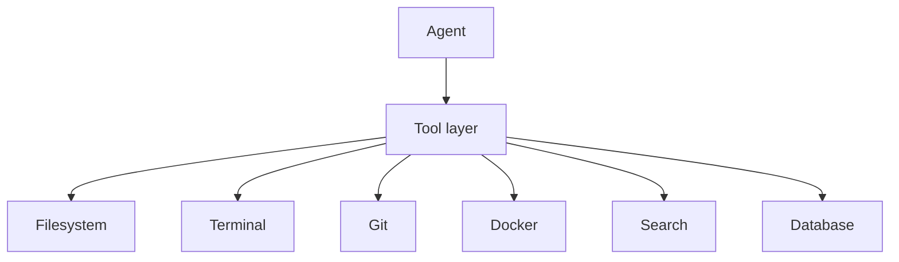

# Tools

Agents never touch the machine directly. They invoke **tools** that return a
uniform `ToolResult`, which keeps every side effect auditable and lets us
sandbox execution (ADR-0001, [security.md](security.md)).

**Source of truth:** `packages/tools/`.



## Interface

Every tool implements `Tool.run(**kwargs) -> ToolResult`:

```python
class ToolResult(BaseModel):
    ok: bool
    output: str = ""
    error: str = ""
    data: dict = {}
```

Expected failures are returned as `ok=False` results (not exceptions) so agents
can reason about outcomes uniformly.

## Tool catalog

Legend: ✅ implemented · 🔜 planned (phase)

### Filesystem ✅
Confined to a project `root`; every path is resolved and checked to stay inside
it (path-escape attempts return an error).

| Action  | Inputs            | Output                         |
|---------|-------------------|--------------------------------|
| `read`  | `path`            | file contents in `output`      |
| `write` | `path`, `content` | `data.bytes` written           |
| `list`  | `path`            | `data.entries` (relative paths)|
| `exists`| `path`            | `data.exists`                  |

**Permissions:** read/write only within `root`. Delete/rename are intentionally
**not** exposed yet (see [security.md](security.md)).

### Terminal 🔜 (Phase: Docker Sandbox)
Execute a command, capture stdout/stderr/exit code, enforce a timeout.
**Permissions:** runs **only inside Docker**, never on the host.

### Git 🔜 (Phase: GitHub Integration)
`status`, `diff`, `branch`, `checkout`, `commit`, (later) push / open PR.

### Docker 🔜 (Phase: Docker Sandbox)
`create sandbox`, `run`, `logs`, `destroy` — resource-limited, network-
restricted containers.

### Search 🔜
Search project files / docs (lexical now, semantic via Qdrant with RAG).

### Database 🔜
Scoped, parameterized queries against the project's own data.

## Contract for new tools

Every tool documents its **inputs, outputs, errors, and permissions**, returns
a `ToolResult`, and never performs an action outside its declared scope. The
formal requirements are in [`../specs/tool-spec.md`](../specs/tool-spec.md).
