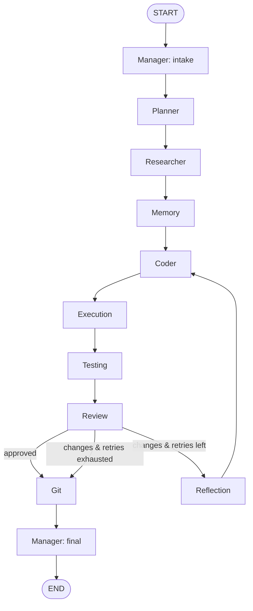
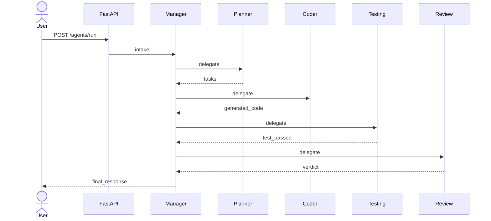

# Workflows

How requests flow through the agent team. The canonical workflow is compiled in
`packages/agents/workflow.py`; this document explains it and the variants.

## The full workflow (compiled today)

Every request runs this graph. The conditional edge after **Review** is what
makes it adaptive.

## Sequence (happy path)

## Named workflows

These are *intents* expressed over the same graph (the Planner shapes the task
list; the Manager decides which specialists are needed). They describe the
**common shapes**, not separate graphs.

### Add a feature (e.g. "Add JWT Authentication")
`Manager → Planner → Research → Memory → Coder → Execution → Testing → Review → Git → Done`
The full path. Review must approve before Git.

### Bug fix
`Manager → Planner → Research → Coder → Execution → Reflection → retry → Done`
Heavier on the reflection loop: run, observe the failure, diagnose, fix, re-run
until tests pass or `max_retries` is hit.

### Quick edit / refactor
`Manager → Planner → Coder → Review → Done`
Research/Memory may be skipped when the change is local and self-contained.

## The reflection loop

When Review returns `changes_requested` (today: driven by failing tests):

1. If `retry_count < max_retries` → go to **Reflection**.
2. Reflection reads the recent logs + review feedback, proposes a fix, bumps
   `retry_count`, clears the failure signal, and routes back to **Coder**.
3. Otherwise → go to **Git** and let the Manager report a non-approval.

This bounded loop is what gives ForgeAI self-correction without infinite loops.
See [state.md](state.md) for the fields involved and
[agents.md](agents.md#reflection) for the agent.
